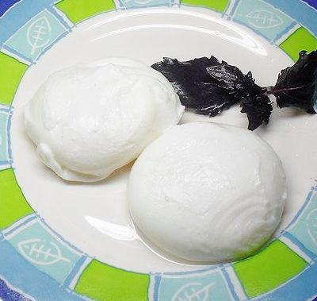

# Введение
Завтрак — первый и самый важный прием пищи за день.
Данная статья описывает процесс приготовления завтрака с яйцом пашот и семгой. Завтрак рассчитан на 1 персону.
Завтрак будет состоять из:
* Тоста с авокадо и семгой
* Зернового кофе

Для вкусного завтрака очень важно, чтобы готовая еда не успела остыть. Для этого необходимо, чтобы все элементы были готовы в одно время. Поэтому, приготовление завтрака будет состоять из 2 этапов:
1. Изготовление заготовок
2. Сборка завтрака

Ингридиенты и инструменты следует подготовить заранее.

## Критерии успешности

Оценивать готовый завтрак можно по таблице ниже:

| Одновременно приготовлено блюд, % |  Оценка | Результат|
|:-------------:|-----------|---|
| **≥ 99**| Великолепно | Райское наслаждение, эйфория
|**> 50** | Удовлетворительно| Производительность +10% 
|**< 50** | Неудовлетворительно | Разочарование, досада, суицидальные мысли

# Ингридиенты и инструменты
Для приготовления завтрака вам понадобится такие **ингридиенты**:

| Ингридиент |  Количество | Рекомендации |
| ------------- |:-----------:|---|
| Кофе | 30 г. | Зерновой или молотый. Для использования зернового требуется кофемолка или кофеварка
|  Филе лосося слабосоленое | 1 | Дата производства не более -14 от текущей
|Хлеб зерновой | 1 | Дата производства не более -1 от текущей
| Яйца куриные, категории [С0](https://ru.wikipedia.org/wiki/%D0%AF%D0%B9%D1%86%D0%BE_(%D0%BF%D0%B8%D1%89%D0%B5%D0%B2%D0%BE%D0%B9_%D0%BF%D1%80%D0%BE%D0%B4%D1%83%D0%BA%D1%82)#%D0%9C%D0%B0%D1%80%D0%BA%D0%B8%D1%80%D0%BE%D0%B2%D0%BA%D0%B0_%D0%BA%D1%83%D1%80%D0%B8%D0%BD%D1%8B%D1%85_%D1%8F%D0%B8%D1%86) или [С1](https://ru.wikipedia.org/wiki/%D0%AF%D0%B9%D1%86%D0%BE_(%D0%BF%D0%B8%D1%89%D0%B5%D0%B2%D0%BE%D0%B9_%D0%BF%D1%80%D0%BE%D0%B4%D1%83%D0%BA%D1%82)#%D0%9C%D0%B0%D1%80%D0%BA%D0%B8%D1%80%D0%BE%D0%B2%D0%BA%D0%B0_%D0%BA%D1%83%D1%80%D0%B8%D0%BD%D1%8B%D1%85_%D1%8F%D0%B8%D1%86) | 4 шт. | Лучше купите 10 шт. для тренировки
| Лимон | 1 шт. | 
|Сливочный сыр | 1 уп. | Лучше использовать [Hochland без добавок](https://avatars.mds.yandex.net/get-mpic/1750207/img_id6040164840982075267.jpeg/9hq)
| Масло сливочное 82,5% | 1 шт. | 
| Авокадо | 1 шт. | Соблюдайте [рекомендации по выбору авокадо](https://lifehacker.ru/how-to-choose-avokado/)
|Уксус 9% | 2 столовых ложки | 
| Соль, перец | По вкусу | 

**И инструменты**:

| Инструмент |  Количество | Рекомендации |
| ------------- |:-----------:|---|
Нож | 1 шт. | 
Доска для нарезки | 1 шт. |
Кастрюля | 2 шт. | Можно обойтись одной, но в таком случае соус рискует остыть 
Венчик | 1 шт. | Для помешивания. Если нет, используйте вилку
Шумовка | 1 шт. | Для приготовления яиц-пашот
Бумажные полотенца | 1 рулон |  Для приготовления яиц-пашот
| Турка для кофе | 1 шт. | Можно заменить кофеваркой

# Приготовление завтрака
## Подготовка

Сделайте заготовки:
1. Отрежьте 2 куска хлеба
2. Попойте и [почистите авокадо](https://povar.me/advices/kak-chistit-avokado/). Переложите мякоть в плошку. Мякоть авокадо можно нарезать или просто размять ложкой — это не принципиально 
3. Выньте красную рыбу из упаковки. [Порежьте](https://youtu.be/OWjqcyhhXD8) ее тонкими ломтиками. 
4. Помойте и разрежьте лимон на 4 части

## Голландский соус

Приготовьте соус.
Для этого:
1. Налейте в кастрюлю 1л. воды
2. Поставьте кастрюлю на огонь и дождитесь закипания
2. Поставьте на миску на кастрюлю, чтобы миска согревалась водяным паром
3. [Отделите белки от желтков](https://bit.ua/2018/02/kak-otdelit-zheltki-ot-belkov/) любым удобным способом. Перелейте готовые желтки в миску
3. Положите в миску сливочное масло 
4. Перемешивайте венчиком смесь до полного растворения масла. Масса должна получиться эластичная и однородная. 
5. Выжмите четвертинку лимона в смесь. Не выжимайте сок полностью, а делайте это последовательно. Выжали часть — попробуйте. В соусе должна быть легкая кислинка. Продолжайте помешивать
6. Немного посолите и поперчите. Попробуйте еще раз. Соус должен иметь мягкий сливочно-пломбирный вкус. 
7. Снимите соус с кастрюли и отставьте в сторону. Раз в минуту помешивайте, чтобы не загустел.

## Хлеб

Поджарьте хлеб.
1. Поставьте сковородку на огонь
2. Отрежьте 2 куска хлеба толщиной 1 см. 
3. Положите небольшой кусок сливочного масла в сковородку и дождитесь его растворения
4. Положите хлеб на сковородку и подождите 1-2 минуты. Периодически поднимайте хлеб, чтобы убедиться в его готовности. Следите за тем, чтобы хлеб не подгорел.
5. Переверните хлеб, когда на нем появится оранжево-коричневая корочка
6. Поджарьте хлеб с другой стороны 
7. Оторвите 2 бумажных полотенца и положите на тарелку
8. Переложите кусочки хлеба на бумажные полотенца. Если на хлебе есть сгоревшие места, счистите их ножом. 

## Яйца пашот

Сварите яйца пашот. Перед приготовлением смиритесь с мыслью, что с первого раза не получится. Возможно, и со второго тоже. Ничего страшного в этом нет, особенно, если купить 10 яиц.
1. Налейте 1л. воды в кастрюлю
2. Поставьте кастрюлю на максимальный огонь
3. Добавьте 1 столовую ложку уксуса
4. Дождитесь закипания воды. Уменьшите огонь так, чтобы вода едва булькала
5. Перемешайте ложкой воду, чтобы в кастрюле образовалась воронка
6. Разбейте яйцо и вылейте содержимое на ***переферию*** воронки
7. Разбейте другое яйцо. В свободное место кастрюли. Яйца не должны слипнуться
8. Засеките время. Время зависит от категории яиц:
8.1 С1 — ***3,5 минуты***
8.2 С0 — ***4.0 минуты***
9. Положите на тарелку 2 бумажных полотенца
10. Достанье шумовкой яйцо. Потрогайте белок пальцем — он должен быть упругим.  Положите яйцо на полотенце. Повторите действия с другим яйцом
10.1 Если белок не упругий, или заметен прозрачный белок, положите яйцо обратно и поварите еще 20 секунд
11. Яйцо-пашот готово. 

## Кофе

Сварите кофе. 
Измельчите кофе в кофемолке. Размер гранул должен напоминать поваренную соль. Если кофе уже молотый, пропустите этот пункт. 
Для чашки кофе в 200 мл. потребуется 20г. кофе. В чайной ложке содержится 18г. гранул кофе. Выберите требуемый вес кофе в зависимости от собственных предпочтений.

1. Засыпьте порцию молотого кофе в турку и слегка потрясите
3. Налейте в турку 200 мл. воды
4. Поставьте турку на плиту на средний огонь — скажем, 5 из 9
5. Через 2-7 минут кофе начнет подниматься. Как только заметите, что кофе поднялся, уберите турку с огня
6. Размешайте кофейную шапку
7. Перелейте кофе в чашку тонкой струйкой, чтобы гранулы кофе остались на дне турки.

## Сборка

Все элементы готовы, можно переходить к сборке завтрака.
1. Намажьте хлеб сливочным сыром
2. Положите сверху кусочки красной рыбы
3. На рыбу разложите или намажьте авокадо
4. На авокадо аккуратно перенесите яйцо-пашот
5. Полейте тост голландским соусом
6. Повторите с другим кусочком хлеба
7. Принесите кофе

Вкусный завтрак готов! Приступайте скорее, чтобы не остыл!